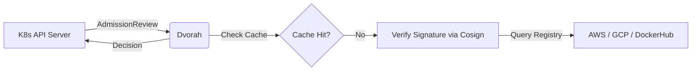

# Dvorah: Multi-Registry Admission Controller

**Dvorah** is a lightweight, stateless Kubernetes Admission Controller focused on image signature verification using **Cosign**. 

It serves as a security gatekeeper for your cluster, ensuring that only images from trusted registries—such as **AWS ECR**, **Google Artifact Registry (GAR)**, and **DockerHub**—are permitted to run, provided they meet your signing policies.

---

## 💡 Why Dvorah?

The name **Dvorah** comes from the Hebrew word for **Bee**. 

Bees are known for their tireless work in keeping the hive clean and safe from external threats. This project is a tribute to my wife, **Debora Cristina**, whose name means "Queen Bee." Like its namesake, this controller acts as the immune system of your Kubernetes cluster, preventing "unverified" or "infected" images from entering your production environment.

---

## 🚀 Key Features

### 🔐 **Agnostic Image Validation**
- **Multi-Registry Support:** Seamlessly integrates with AWS ECR, Google Artifact Registry (GAR), and public registries like DockerHub.
- **Cosign Integration:** Uses [Sigstore/Cosign](https://github.com/sigstore/cosign) to verify container signatures and attestations.
- **Stateless by Design:** Optimized for cloud-native scalability across multiple providers.

### 🛡️ **Governance & Control**
- **Flexible Modes:** Support for `Enforce` (deny unsigned) or `Audit` (log only) modes.
- **Namespace Scoping:** Fine-grained control over which namespaces require signature verification.
- **Registry Allowlist:** Strict control over which image origins are trusted.

### ⚡ **Performance & Observability**
- **Intelligent Caching:** Multi-tier system to reduce latency and avoid registry rate-limiting (Throttling).
- **Cloud-Native Metrics:** Prometheus endpoints and OpenTelemetry integration for full cluster visibility.

---

## 🛠️ Architecture



## Quick Start

### Prerequisites

```bash
# Install required tools
task dependencies-install-mac
```

### Deploying to Kubernetes

```bash
# 1. Create development environment
task dev-create

# 2. Deploy dvorah admission controller
task dvorah-deploy

# 3. Verify deployment
kubectl get pods -n dvorah
```

### Configuration

#### Key Configuration Options
- `-log-level`: Set logging level (`info` or `debug`)
- `-policy-config=config.yaml`: YAML config file for admission policy rules.
- `-mode`: [DEPRECATED] Set to `deny` (block unsigned images) or `audit` (log only)
- `-registry`: [DEPRECATED] Specify allowed ECR registries (comma-separated)
- `-public-key`: [DEPRECATED] Path to Cosign public key for signature verification

### Testing

```bash
# Test dvorah with cosign review
task dvorah-test-cosign
```

### Monitoring

```bash
# Check metrics
kubectl port-forward -n dvorah service/dvorah 8080:8080
curl http://localhost:8080/metrics
```

### Check image

Check if this image has signature
```
cosign tree ghcr.io/betorvs/dvorah:TAG
```

Keyless verification
```
cosign verify "ghcr.io/betorvs/dvorah@TAG" \
--certificate-identity-regexp="https://github.com/betorvs/dvorah/.github/workflows/release.yaml@refs/(heads/main|tags/.*)" \
--certificate-oidc-issuer=https://token.actions.githubusercontent.com
```


### License

This project is licensed under the Apache License, Version 2.0. As a derivative work of firebolt-db/firebolt-auror, it maintains all original copyright notices.