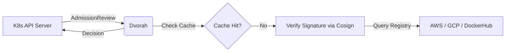

# Dvorah: Multi-Registry Admission Controller

**Dvorah** is a lightweight, stateless Kubernetes Admission Controller focused on image signature verification using **Cosign**. 

It serves as a security gatekeeper for your cluster, ensuring that only images from trusted registries - such as **AWS ECR**, **Google Artifact Registry (GAR)**, and **DockerHub** — are permitted to run, provided they meet your signing policies.

---

## 💡 Why Dvorah?

The name **Dvorah** comes from the Hebrew word for **Bee**. 

Bees are known for their tireless work in keeping the hive clean and safe from external threats. This project is a tribute to my wife, **Debora Cristina**, whose name means "Queen Bee." Like its namesake, this controller acts as the immune system of your Kubernetes cluster, preventing "unverified" or "infected" images from entering your production environment.

---

## ⚖️ Strategic Comparison: Why Dvorah?
In the vast Cloud Native (CNCF) ecosystem, choosing the right Admission Controller is a balance between power and operational overhead. While industry giants offer broad feature sets, Dvorah is built for a specific mission: High-speed, Zero Trust image verification with zero friction.

### Dvorah vs. The Ecosystem

| Feature |	Dvorah	| Kyverno |	Policy-controller |
| -- | -- | -- | -- |
| Primary Focus |	Signature Enforcement |	Full Cluster Governance |	Sigstore Ecosystem |
| Complexity |	Low (Single binary/config) |	High (Large CRD footprint) |	Medium (Enforcement  |only) |
| Learning Curve |	Minutes |	Weeks |	Hours |
| Configuration |	Simple YAML + Hot-Reload |	Complex DSL / Multiple CRDs |	Policy CRDs |
| Resource Usage |	Ultra-lightweight (Go-native) |	Moderate to High |	Moderate |
| Best For	| Lean DevSecOps teams |	Enterprise-wide compliance |	Strict Sigstore users |

### 🎯 The "Scalpel vs. Swiss Army Knife" Argument

**Kyverno: The Governance Engine**

Kyverno is the "Swiss Army Knife" of Kubernetes. It can mutate labels, generate resources, and validate almost anything. However, this power comes with a price: a steep learning curve and a significant operational "tax." If your primary goal is verifying image signatures, Kyverno is often overkill—adding unnecessary complexity to your cluster's control plane.

**Policy-controller: The Sigstore Specialist**  

Developed by the Sigstore project, the policy-controller is excellent for those deeply embedded in their specific ecosystem. While powerful, it still relies on managing multiple Custom Resource Definitions (CRDs) and can be rigid for teams that need to bridge different cloud providers and registry patterns quickly.

**Dvorah: The Precision Scalpel**

Dvorah is designed for engineers who value simplicity and speed.

- Zero CRD Overhead: Dvorah doesn't clutter your cluster with custom resources. It uses a single, intuitive configuration file.
- Operational Agility: With built-in Hot-Reload (via fsnotify), security policies are updated in real-time without restarting the controller or redeploying manifests.
- Developer-First DevSecOps: It bridges the gap between security requirements and developer velocity. It’s easy to understand, easy to audit, and fast to execute.

### 📍 Where Dvorah Fits

Dvorah is the ideal choice for:
1. Lean Teams: Who need "Shift Left" security without hiring a dedicated team to manage policies.
2. Edge & Resource-Constrained Clusters: Where CPU and memory footprint actually matter.
3. Keyless-First Workflows: Teams leveraging GitHub Actions OIDC and Sigstore for automated, secure deployments.

---

## 🚀 Key Features

### 🔐 **Agnostic Image Validation**
- **Multi-Registry Support:** Seamlessly integrates with AWS ECR, Google Artifact Registry (GAR), and public registries like DockerHub.
- **Cosign Integration:** Uses [Sigstore/Cosign](https://github.com/sigstore/cosign) to verify container signatures and attestations.
- **Stateless by Design:** Optimized for cloud-native scalability across multiple providers.

### 🛡️ **Governance & Control**
- **Flexible Modes:** Support for `Enforce` (deny unsigned) or `Audit` (log only) modes.
- **Namespace Scoping:** Fine-grained control over which namespaces require signature verification.
- **Registry Allowlist:** Strict control over which image origins are trusted.

### ⚡ **Performance & Observability**
- **Intelligent Caching:** Multi-tier system to reduce latency and avoid registry rate-limiting (Throttling).
- **Cloud-Native Metrics:** Prometheus endpoints and OpenTelemetry integration for full cluster visibility.

---

## 🛠️ Architecture



## Quick Start

### Prerequisites

```bash
# Install required tools
task dependencies-install-mac
```

### Deploying to Kubernetes

```bash
# 1. Create development environment
task dev-create

# 2. Deploy dvorah admission controller
task dvorah-deploy

# 3. Verify deployment
kubectl get pods -n dvorah
```

### Configuration

#### Key Configuration Options
- `-log-level`: Set logging level (`info` or `debug`)
- `-policy-config=config.yaml`: YAML config file for admission policy rules.
- `-mode`: [DEPRECATED] Set to `deny` (block unsigned images) or `audit` (log only)
- `-registry`: [DEPRECATED] Specify allowed ECR registries (comma-separated)
- `-public-key`: [DEPRECATED] Path to Cosign public key for signature verification

### Testing

```bash
# Test dvorah with cosign review
task dvorah-test-cosign
```

### Monitoring

```bash
# Check metrics
kubectl port-forward -n dvorah service/dvorah 8080:8080
curl http://localhost:8080/metrics
```

### Check image

Check if this image has signature
```
cosign tree ghcr.io/betorvs/dvorah:TAG
```

Keyless verification
```
cosign verify "ghcr.io/betorvs/dvorah@TAG" \
--certificate-identity-regexp="https://github.com/betorvs/dvorah/.github/workflows/release.yaml@refs/(heads/main|tags/.*)" \
--certificate-oidc-issuer=https://token.actions.githubusercontent.com
```


### License

This project is licensed under the Apache License, Version 2.0. As a derivative work of firebolt-db/firebolt-auror, it maintains all original copyright notices.